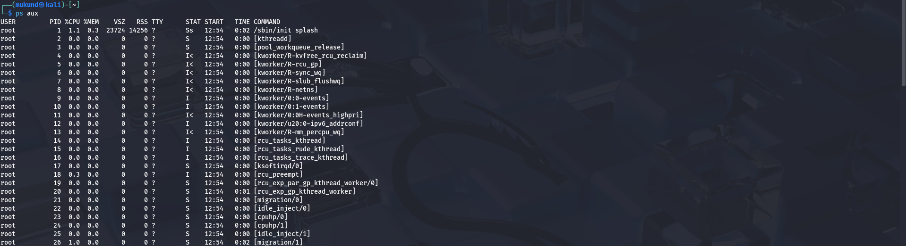
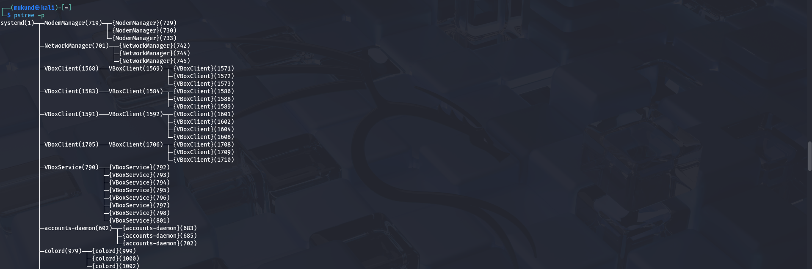
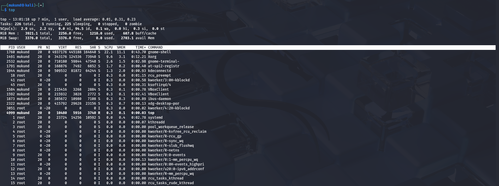
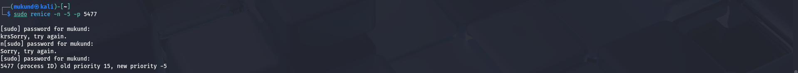
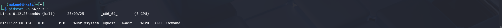

# 🌟 Lab 8 – Process Management in Linux 🌟

## 1. Process Status

**💻 Command:**
```bash
ps aux
````

**📝 Explanation:**

  * `a` → show processes for all users
  * `u` → show user/owner of process
  * `x` → show processes not attached to a terminal



-----

## 2\. Process Tree

**💻 Command:**

```bash
pstree -p
```

**👉 Shows parent-child process relationships.**



-----

## 3\. Real-Time Monitoring

**💻 Command:**

```bash
top
```



-----

## 4\. Adjust Process Priority

**💻 Start a process with low priority:**

```bash
nice -n 10 sleep 300 &
```

**📊 OUTPUT:**
Note the **PID** (e.g., `x`) for subsequent steps.


-----

## 5\. Change Priority of a Running Process

**💻 Command:**

```bash
renice 5 -p x
```

*(Replace `x` with the actual PID)*



-----

## 6\. I/O Scheduling Priority

**💻 Command:**

```bash
ionice -c 3 -p x
```

*(Replace `x` with the actual PID)*

**📊 OUTPUT:**

```
successfully set pid x's IO scheduling class to idle
```


-----

## 7\. File Descriptors Used by a Process

**💻 Command:**

```bash
lsof -p x | head -5
```

*(Replace `x` with the actual PID)*


-----

## 8\. Monitor Open Files Globally

**💻 Command:**

```bash
lsof | less
```


-----

## 9\. Find Process Using a Port

**💻 Command:**

```bash
sudo fuser -n tcp 8080
```

**📊 OUTPUT:**

```
8080/tcp: 4321
```

*(The number is the PID using the port)*


-----

## 10\. Per-Process Statistics

**💻 Command:**

```bash
pidstat -p x 2 3
```

*(Replace `x` with the actual PID)*



-----

## 11\. Control Groups (cgroups) for Resource Limits

**💻 Create a new cgroup:**

```bash
sudo cgcreate -g cpu,memory:/testgroup
```

**💻 Limit CPU and Memory:**

```bash
echo 50000 | sudo tee /sys/fs/cgroup/cpu/testgroup/cpu.cfs_quota_us
echo 100M | sudo tee /sys/fs/cgroup/memory/testgroup/memory.limit_in_bytes
```

*(Note: `50000` is 50% of one CPU core, and `100M` is 100 Megabytes.)*


```
```