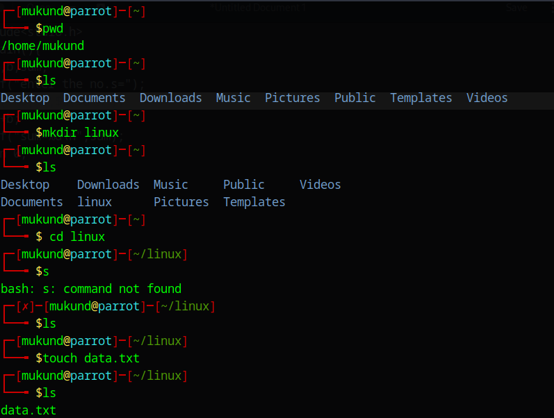
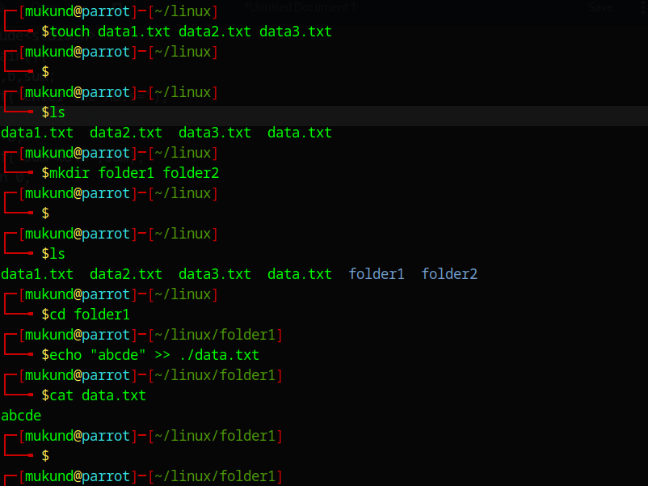
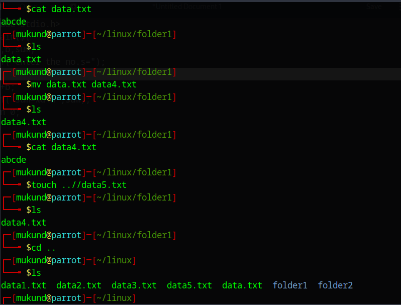
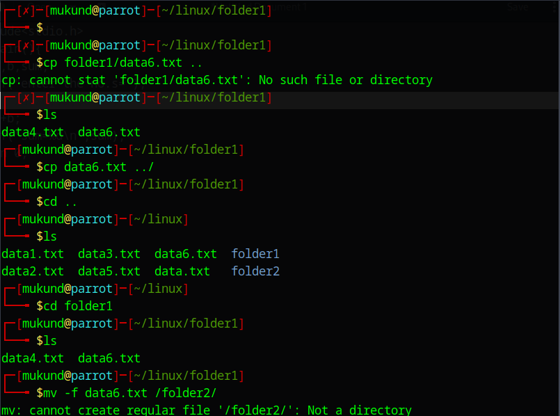
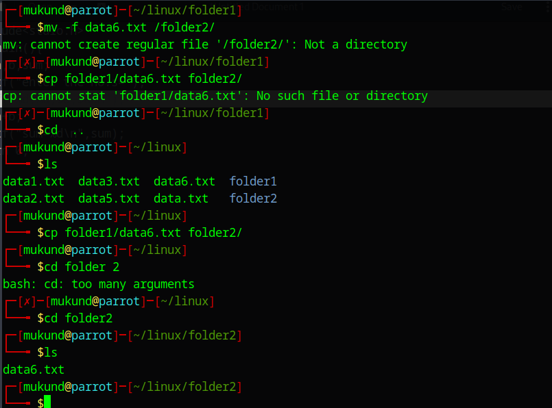

# 🥼LAB-4 COMMANDS

````markdown
# 🖥️ LAB 4: Linux Basic File Commands  

Welcome to **Linux Lab 4**!  
This guide will walk you through some essential Linux commands: `touch`, `cp`, `mv`, `echo`, and `cat`.  
Each section comes with clear explanations ✅ and practical examples 💡.

---

## 📌 1. `touch` — Create Files or Update Timestamps  
**Purpose:** Create an empty file or update the timestamp of an existing file.

💡 **Tip:** You can create multiple files at once!

```bash
# Create an empty file named file1.txt
touch file1.txt

# Create multiple files at once
touch file2.txt file3.txt
````

---

## 📌 2. `cp` — Copy Files and Directories

**Purpose:** Copy files or directories from one place to another.

💡 **Tip:** Use `-r` to copy directories recursively.

```bash
# Copy file1.txt to backup.txt
cp file1.txt backup.txt

# Copy a file to another directory
cp file1.txt /home/user/Documents/

# Copy a directory and its contents
cp -r myfolder /home/user/backup/
```

---

## 📌 3. `mv` — Move or Rename Files/Directories

**Purpose:** Move files or rename them.

💡 **Tip:** Moving a file into a different folder will also rename it if you change the name in the path.

```bash
# Rename file1.txt to file_renamed.txt
mv file1.txt file_renamed.txt

# Move file to another directory
mv file2.txt /home/user/Desktop/
```

---

## 📌 4. `echo` — Print or Write Text to Files

**Purpose:** Display text on the terminal or write it to files.

💡 **Tip:** Use `>>` to append instead of overwriting.

```bash
# Print a message
echo "Hello, Linux!"

# Write text to a file (overwrite existing content)
echo "This is a test file" > test.txt

# Append text to a file
echo "Adding more content" >> test.txt
```

---

## 📌 5. `cat` — View and Combine File Contents

**Purpose:** View file content, concatenate files, or create new files.

💡 **Tip:** Combine multiple files into one with `>`.

```bash
# View file contents
cat test.txt

# Concatenate multiple files into one
cat file2.txt file3.txt > merged.txt

# Create a file with content using cat
cat > notes.txt
This is a note.
Press CTRL+D to save and exit.
```

---

## 🖼️ Screenshots

Here’s how the commands might look in a real Linux terminal:





---
```
✅ **End of Lab 4** — You’ve now learned how to create, copy, move, print, and view files in Linux! 🚀


